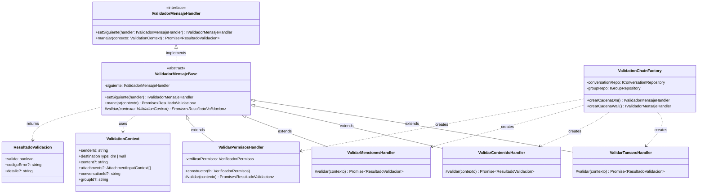
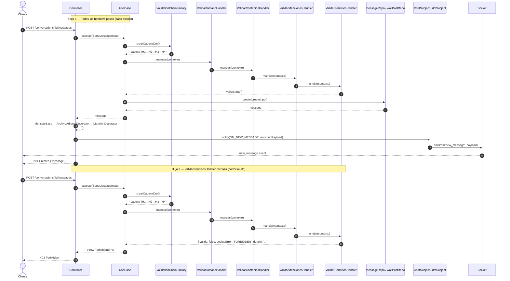

# chat-service — ms-chat

Microservicio de comunicación de UniConnect. Gestiona mensajes directos (DM) entre usuarios y publicaciones en el muro de grupos de estudio (Wall).

---

## Stack

- **Runtime:** Node.js 20 + TypeScript
- **HTTP:** Express
- **WebSockets:** Socket.IO
- **Base de datos:** Supabase (PostgreSQL)
- **Arquitectura:** Clean Architecture (Domain → Application → Infrastructure)

---

## Endpoints REST

| Método | Ruta | Descripción |
|--------|------|-------------|
| `GET`  | `/api/conversations` | Lista conversaciones del usuario autenticado |
| `POST` | `/api/conversations` | Crea o recupera una conversación DM |
| `GET`  | `/api/conversations/:id` | Detalle de conversación con perfil del otro participante |
| `GET`  | `/api/conversations/:id/messages` | Lista mensajes paginados (cursor) |
| `POST` | `/api/conversations/:id/messages` | **Envía un mensaje DM** |
| `GET`  | `/api/walls` | Wall inbox del usuario (grupos activos) |
| `GET`  | `/api/groups/:groupId/wall` | Posts del muro de un grupo |
| `POST` | `/api/groups/:groupId/wall` | **Publica en el muro de un grupo** |
| `GET`  | `/api/attachments/dm/:id/url` | URL firmada de adjunto DM |
| `GET`  | `/api/attachments/wall/:id/url` | URL firmada de adjunto Wall |

---

## Eventos WebSocket

| Evento (cliente → servidor) | Descripción |
|-----------------------------|-------------|
| `dm:join` | Une al cliente a la sala de una conversación DM |
| `dm:leave` | Abandona la sala DM |
| `wall:join` | Une al cliente al canal de muro de un grupo |
| `wall:leave` | Abandona el canal del muro |

| Evento (servidor → cliente) | Descripción |
|-----------------------------|-------------|
| `dm:new_message` | Nuevo mensaje DM con payload enriquecido |
| `wall:new_post` | Nueva publicación de muro con payload enriquecido |
| `error` | Error de socket (autenticación, permisos) |

---

## Patrones de Diseño Implementados

### US-O02 — Observer

`ChatSubject` mantiene una lista de `IObserver`. Existen dos instancias independientes:

- **`dmSubject`** → notifica a `DmSocketObserver` → emite `dm:new_message`
- **`chatSubject`** → notifica a `WallSocketObserver` → emite `wall:new_post`

Los controladores llaman a `subject.notify(evento, payload)` **después** de que el Use Case persiste el mensaje.

### US-O02 — Decorator

Antes de notificar al Observer, el controlador enriquece el payload con una cadena de decoradores:

```
MensajeBase(rawPayload)
  → ArchivoAdjuntoDecorator  (normaliza el array de adjuntos)
    → MencionDecorator        (detecta @menciones y las lista en mentions[])
      → getPayload()          → payload final enviado por socket
```

---

### US-CH01 — Chain of Responsibility (Validación de Mensajes)

Implementa validación de mensajes mediante una cadena de handlers desacoplados.  
Cada handler tiene **una sola responsabilidad**, puede ser extendido sin modificar los existentes,  
y la cadena se corta en el primer handler que falla.

#### Flujo de integración

```
HTTP Request
    │
    ▼
Controller  (parsea body y attachments)
    │
    ▼
Use Case  ──► ValidationChainFactory.crearCadenaDm() / crearCadenaWall()
    │              │
    │          [ValidarTamanoHandler]
    │              │ pasa
    │          [ValidarContenidoHandler]
    │              │ pasa
    │          [ValidarMencionesHandler]
    │              │ pasa
    │          [ValidarPermisosHandler]
    │              │
    │         valido: true ──► messageRepo.create() / wallPostRepo.create()
    │         valido: false ──► ForbiddenError | ValidationError  (cortocircuito)
    │
    ▼
Controller  (decoradores + subject.notify())
    │
    ▼
Socket → Cliente
```

#### Diagrama de Clases



#### Diagrama de Secuencia



---

## Cómo extender la cadena de validación

Para añadir `ValidarAdjuntoHandler` (u otro handler futuro):

1. Crear `src/application/validation/ValidarAdjuntoHandler.ts` extendiendo `ValidadorMensajeBase`.
2. Importarlo en `ValidationChainFactory.ts`.
3. Instanciarlo e insertarlo en el encadenamiento dentro de `crearCadenaDm()` y/o `crearCadenaWall()`.

**Ningún handler existente se modifica.**

---

## Variables de Entorno

| Variable | Descripción | Default dev |
|----------|-------------|-------------|
| `PORT` | Puerto HTTP del servicio | `3001` |
| `SUPABASE_URL` | URL del proyecto Supabase | — |
| `SUPABASE_SERVICE_ROLE_KEY` | Clave de servicio Supabase | — |
| `NOTIFICATION_SERVICE_URL` | URL del servicio de notificaciones | `http://localhost:3005/notifications` |

Ver `.env.example` para el template completo.
