# Patrón Observer — Eventos de Dominio

El microservicio implementa el **Patrón de Diseño Observer** (GoF) para desacoplar la lógica de negocio de los efectos secundarios, como notificaciones en tiempo real y persistencia de alertas. Cuando ocurre un evento relevante en un grupo de estudio, el Subject notifica a todos los Observers registrados de forma automática y asíncrona.

## Diagrama UML

```mermaid
classDiagram
    direction LR

    class IObserver {
        <<interface>>
        +update(event: StudyGroupEvent) void
    }

    class ISubject {
        <<interface>>
        +subscribe(observer: IObserver) void
        +unsubscribe(observer: IObserver) void
        +notify(event: StudyGroupEvent) void
    }

    class StudyGroupSubject {
        -observers: Set~IObserver~
        +subscribe(observer: IObserver) void
        +unsubscribe(observer: IObserver) void
        +notify(event: StudyGroupEvent) Promise~void~
    }

    class WebSocketNotificationObserver {
        -io: SocketIOServer
        -DOMAIN_EVENT_NAME: string
        +update(event: StudyGroupEvent) Promise~void~
    }

    class PersistenciaNotificacionObserver {
        -TABLE_NAME: string
        +update(event: StudyGroupEvent) Promise~void~
        -generateMessage(event) string
    }

    class StudyGroupEventType {
        <<enumeration>>
        SOLICITUD_INGRESO
        MIEMBRO_ACEPTADO
        MIEMBRO_RECHAZADO
        TRANSFERENCIA_ADMIN
    }

    class StudyGroupEvent {
        +type: StudyGroupEventType
        +groupId: string
        +actorUserId: string
        +targetUserId?: string
        +metadata?: Record
    }

    ISubject <|.. StudyGroupSubject : implements
    IObserver <|.. WebSocketNotificationObserver : implements
    IObserver <|.. PersistenciaNotificacionObserver : implements
    StudyGroupSubject o-- IObserver : manages
    StudyGroupSubject ..> StudyGroupEvent : notifies with
    WebSocketNotificationObserver ..> StudyGroupEvent : handles
    PersistenciaNotificacionObserver ..> StudyGroupEvent : handles
    StudyGroupEvent --> StudyGroupEventType : typed by
```



## Eventos de Dominio

| `StudyGroupEventType`   | Cuándo se dispara                              | Quién recibe la notificación |
|-------------------------|------------------------------------------------|------------------------------|
| `SOLICITUD_INGRESO`     | Un usuario solicita unirse a un grupo          | El administrador del grupo   |
| `MIEMBRO_ACEPTADO`      | El admin acepta la solicitud de ingreso        | El usuario solicitante       |
| `MIEMBRO_RECHAZADO`     | El admin rechaza la solicitud de ingreso       | El usuario solicitante       |
| `TRANSFERENCIA_ADMIN`   | El admin inicia una transferencia de rol       | El nuevo administrador       |

## Flujo de un Evento (Ejemplo: Aceptar Solicitud)

```text
HTTP Request (POST /groups/:id/accept-request)
        │
        ▼
AcceptStudyGroupRequestUseCase.execute()
  ├─ [1] Validaciones de negocio
  ├─ [2] Persistencia: addMember() + removePendingRequest()
  ├─ [3] studyGroupRealtimeBus.publishStudyGroupUpdated()  ← refresca datos en sala del grupo
  └─ [4] studyGroupSubject.notify({ type: MIEMBRO_ACEPTADO, ... })
                │
                ├──▶ WebSocketNotificationObserver.update()
                │       ├─ io.to("study-group:{groupId}").emit(...)   ← sala del grupo
                │       └─ io.to("user:{targetUserId}").emit(...)     ← sala personal del usuario
                │
                └──▶ PersistenciaNotificacionObserver.update()
                        └─ supabase.from("notifications").insert(...)  ← campanita persistida
```

## Principios aplicados

- **Open/Closed**: Agregar un nuevo observer (ej. Email) no requiere modificar los UseCases.
- **Single Responsibility**: Cada observer tiene una única responsabilidad (websockets vs persistencia).
- **Dependency Inversion**: Los UseCases dependen de `ISubject` (abstracción), no de las implementaciones concretas.
- **Resiliencia**: Un fallo en un observer no interrumpe al resto ni al flujo HTTP principal (`Promise.allSettled`).

## Ubicación en el Código

```text
src/
├── study-groups/
│   └── domain/
│       └── events/
│           ├── studyGroupEvents.ts          # ISubject, IObserver, enum, StudyGroupEvent
│           └── studyGroupSubject.ts         # StudyGroupSubject (Singleton)
│   └── infrastructure/
│       └── observers/
│           ├── WebSocketNotificationObserver.ts    # Emite vía Socket.IO
│           └── PersistenciaNotificacionObserver.ts # Persiste en Supabase
└── infrastructure/
    └── socket/
        └── studyGroupSocketServer.ts        # Punto de registro de observers al inicializar
```
